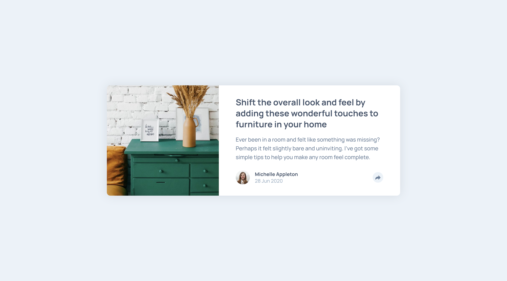

# Frontend Mentor - Article preview component solution

This is a solution to the [Article preview component challenge on Frontend Mentor](https://www.frontendmentor.io/challenges/article-preview-component-dYBN_pYFT). Frontend Mentor challenges help you improve your coding skills by building realistic projects.

## Table of contents

- [Overview](#overview)
  - [The challenge](#the-challenge)
  - [Screenshot](#screenshot)
  - [Links](#links)
- [My process](#my-process)
  - [Built with](#built-with)
  - [What I learned](#what-i-learned)
  - [Continued development](#continued-development)
  - [Useful resources](#useful-resources)
- [Author](#author)

## Overview

### The challenge

Users should be able to:

- View the optimal layout for the component depending on their device's screen size
- See the social media share links when they click the share icon

### Screenshot

### Links

- Solution URL: [My Solution](https://your-solution-url.com)
- Live Site URL: [Live](https://matiasbastarrica.github.io/article-preview-component/)

## My process

### Built with

- Semantic HTML5 markup
- CSS custom properties
- Flexbox
- Mobile-first workflow
- JavaScript

### What I learned

I learned to show a modal when the user clicks on a button. This lead me to discover how to show an hide elements using JavaScript and CSS

### Continued development

I'd like to continue to practice JavaScript by adding more interactivy to the challenges

### Useful resources

- [Cropping images with CSS](https://www.digitalocean.com/community/tutorials/css-cropping-images-object-fit) - This helped me to cropped an image. I really liked this method and will use it going forward.
- [Text bubble triangle effect](https://projects.verou.me/bubbly/) - This is an amazing website which helped me finally understand how to make a triangle in CSS. I'd recommend it to anyone still learning this concept.

## Author

- Frontend Mentor - [@MatiasBastarrica](https://www.frontendmentor.io/profile/MatiasBastarrica)
